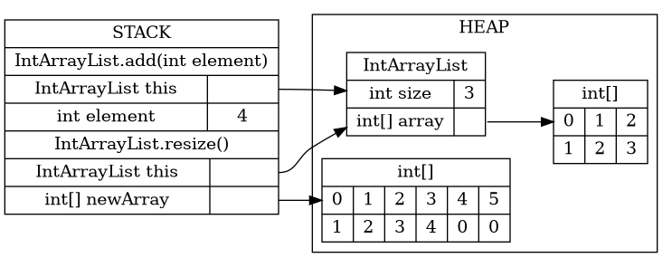

## Challenge

1. To complete our ArrayList implementation, we need to add two more methods: `remove()` and `resize()`.    
a. Implement the `remove()` method, which removes the element at a given index in an MyArrayList.  
b. The `resize()` method is a bit more complicated. The memory diagrams, below, show what we want to happen step-by-step. Implement the `resize()` method, referring to the diagrams. Note that this is a private method that does not take any arguments and does not return anything.

    
    
    
  
    c. Finally, update your `add()` method to make use of `resize()`. Your implementation of MyArrayList is now complete.

3. To complete our MyLinkedList implementation, we only need to add one method: `remove()`.    
a. Why do we _not_ need a `resize()` method for MyLinkedList?  
b. The code for the `remove()` method can be broken down into four cases. What are they? What should the code do in each case?  
c. Write the code for `remove()`.  Your implementation of MyLinkedList is now complete.

4. Sections 4.6-4.8 of Zybooks describe a data structure called the doubly-linked list. in short, the main distinguishing feature of a doubly-linked list is that nodes have both `next` and `prev` pointers, that point to the next node and the previous node respectively. This means that the code for a doubly-linked list is almost exactly the same as that for a singly-linked lists, except for the node pointers that you have to change when adding and removing elements.    
a. Without writing any code, explain how you would need to modify your MyLinkedList `add()` method to turn your implementation into a doubly-linked list.  
b. Without writing any code, explain how you would need to modify your MyLinkedList `remove()` method to turn your implementation into a doubly-linked list. How would each of the four cases change?

